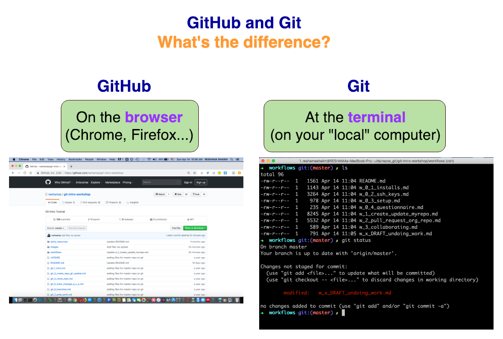

# Workflows

---

## What It's All About
- version control

## GitHub and Git

### GitHub    -->  [browser]
GitHub is a **website** that allows you to upload your git respositories online. It allows you to have a backup of your files, has a visual interface to navigate your repos, and it allows other people to be able to view your repos. 

GitHub is a central place to store your repo, so others can clone it, push to it, and pull from it.

It also includes some very nice tools for software projects, like Markdown README rendering, issue tracker and wiki tools, and the ability to “fork” a project to make your own independent copy of it for development.

### Git     --> [terminal]
Git is a system for version control. It runs at the **command line on your local machine** and allows you to keep track of your files and modifications in a "repository". 

## Why it's good to know Git
- **version control**
- **backing up your code**
- open source
- can share your coding work publicly
- can collaborate with others on projects
- knowing version control lets you contribute to open source (these repos are public)

## Intro to GitHub
- avatar / "Your profile" 
- avatar / "Settings"

---

## Flow for Write/Speak/Code 2019  
1.  intro to Git & Github
2.  go over GitHub options
3.  everyone creates GitHub account
4.  create a repo on GitHub

If there is time, we will:  
1.  do Git install
2.  fork / clone repo

---
## Setup

### [Workflow 0.1](w_0_1_installs.md): software installations
- terminal access
- git 
- GitHub account
- editor

### [Workflow 0.2](w_0_2_ssh_keys.md): SSH keys setup (optional)
- create `ssh` keys
- add `ssh` key to GitHub

### [Workflow 0.3](w_0_3_setup.md): general setup
- configure user
- set up working directory

### [Workflow 0.4](w_0_4_questionnaire.md): questionnaire (optional)
- complete questionnaire

---

## [Workflow 1](w_1_create_update_myrepo.md): create & update your repo
- create repo on GitHub
  - add, update files on GitHub
- clone (copy) GH repo to local computer
  - look at remotes
  - work with branches
  - add, update files at Git terminal and send changes up to GH
  - submit a pull request 

## [Workflow 2](w_2_pull_request_org_repo.md): fork & update an organization repo 
- fork/clone an organization's repo
- add updates and submit a pull request

## [Workflow 3](w_3_collaborating.md): add a collaborator to your repo and manage pull requests
- using the repo from Workflow 1, add a collaborator
- the collaborator will make updates to your repo and submit pull requests
- you will accept their pull requests
