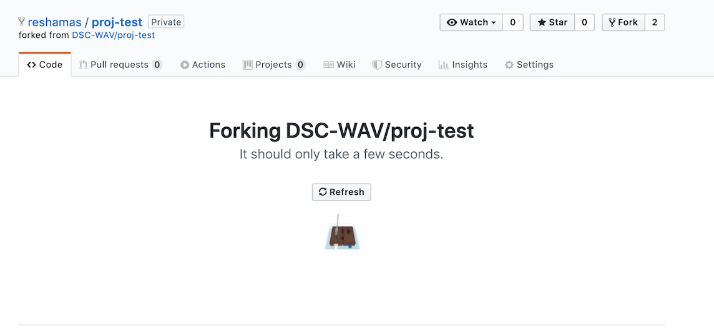
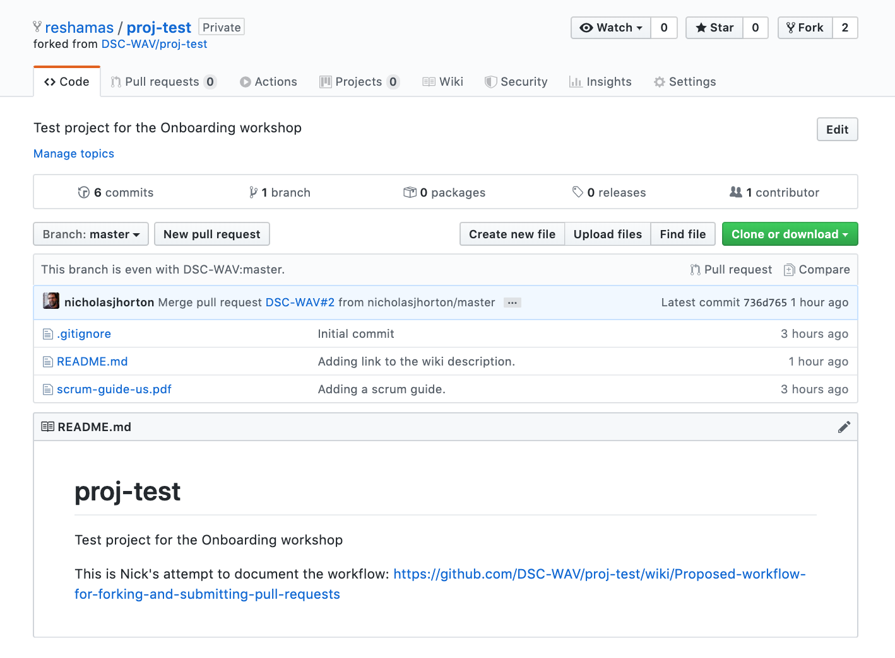
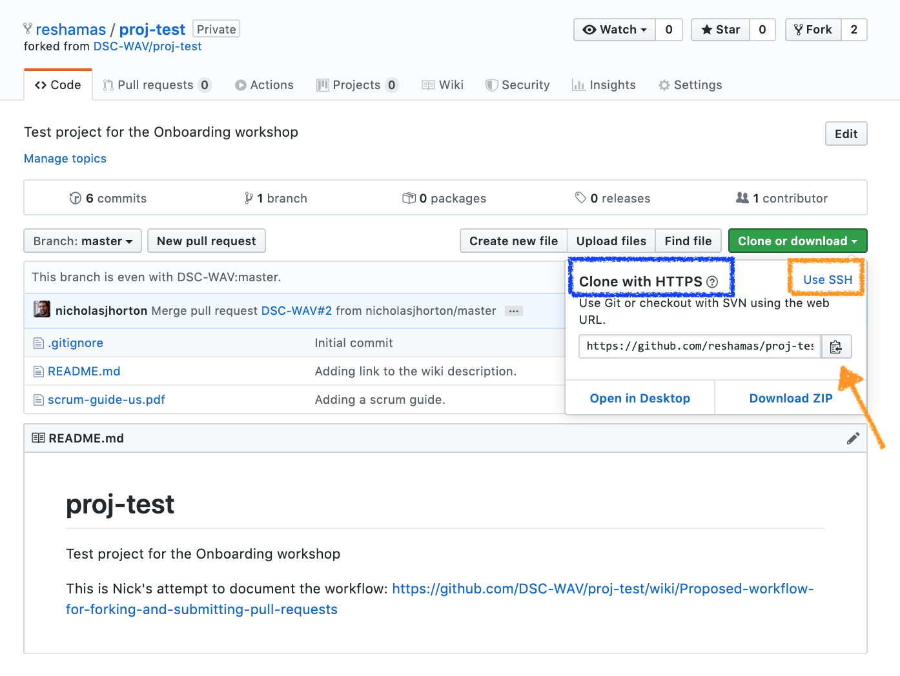
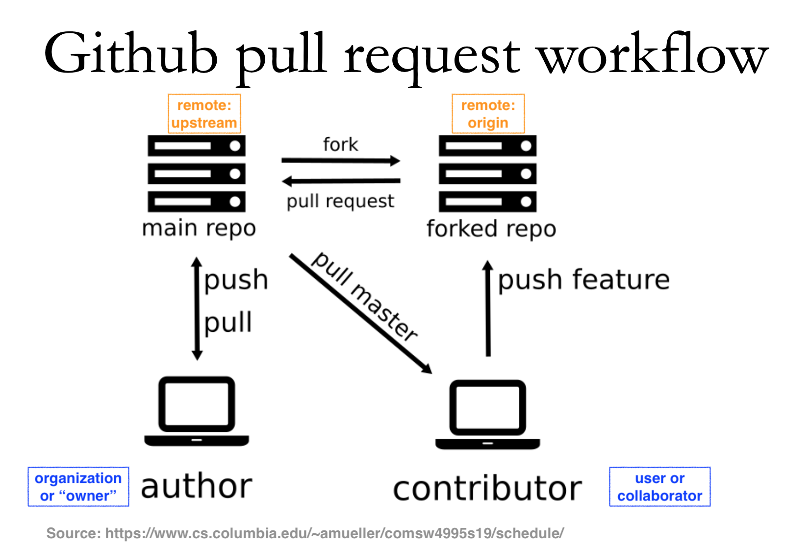
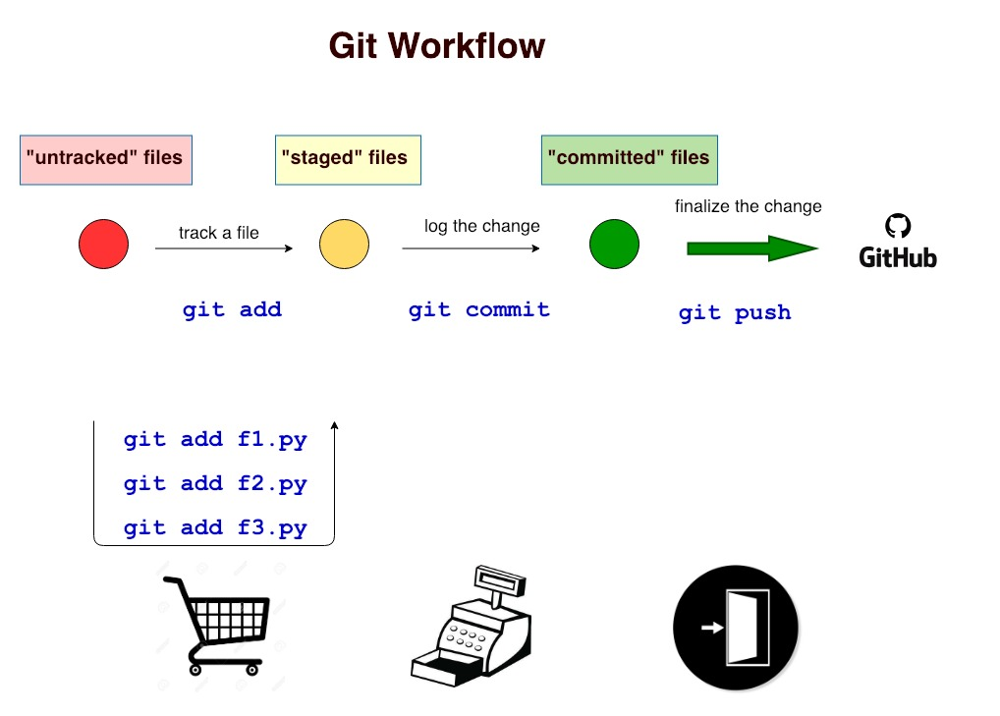

# Workflow for DSC-WAV:  Clone, Fork and Submit PR

#### This is your checklist:
- [ ] Navigate to (private) repo on GitHub (GH)
- [ ] Fork a repo on GitHub
- [ ] Clone a repo
- [ ] Look at remotes
- [ ] Add a remote
- [ ] Send a change
- [ ] Push changes to GH from terminal
- [ ] Submit a pull request (PR) on GH
- [ ] Update a repo 


---
## Step 1:  Navigate to repo on GitHub
This is the test repository we are practicing with:  [https://github.com/DSC-WAV/proj-test](https://github.com/DSC-WAV/proj-test)

## Step 2:  Fork repo to your account [only done once]

### Step 2a:  Find the 'fork' option

<kbd>
<p>

</p>
</kbd>


<p>


### Step 2b:  The repo is being forked... 

</p>

<kbd>
<p>

</p>
</kbd>

<p>
	
### Step 2c:  The repo has been forked!

</p>

<kbd>
<p>

</p>
</kbd>


## Step 3: Get URL to `clone` the repo from GitHub to our terminal

**Q:  What is cloning?**  
**A:  Making a copy of something.**

<p>

</p>


### Copy URL for cloning
We will make a copy of the repo.  Click on the green button for your forked GitHub repo.  Copy that URL.    <br> 
   <br> <br>

Select the method:  
- Option 1:  If you have `ssh` keys set up, select `ssh`
- Option 2:  If you have *not* set up `ssh` keys, can use the **Clone with HTTPS** 

`Copy` the URL.  

<kbd>
<p float="left">
   
  
</p>
</kbd>

<p>
</p>


>example of my repo's URL
```text
git@github.com:reshamas/proj-test.git
```

## Step 4:  go to working directory (your local terminal)
Go to your working directory  
>my example
```bash
cd ~/Desktop/gitsample
```

**P**rint **w**orking **d**irectory:  
<kbd> pwd </kbd>

>my example
```bash
pwd
/Users/reshamashaikh/Desktop/gitsample
```  

## Step 5:  Clone the repo  
<kbd> git clone <url_name> </kbd> 
>my example
```bash
git clone git@github.com:reshamas/proj-test.git
```
```bash
$ git clone git@github.com:reshamas/proj-test.git
Cloning into 'proj-test'...
remote: Enumerating objects: 20, done.
remote: Counting objects: 100% (20/20), done.
remote: Compressing objects: 100% (19/19), done.
remote: Total 20 (delta 6), reused 4 (delta 0), pack-reused 0
Receiving objects: 100% (20/20), 478.68 KiB | 3.42 MiB/s, done.
Resolving deltas: 100% (6/6), done.
$
```

## Step 6:  `cd` into the repo
List contents of the current directory.  
<kbd> ls </kbd>

>my example
```bash
$ ls
proj-test
$
```
Change directory into the repo directory we just cloned.  
<kbd> cd <repo_name> </kbd>
>my example
```bash
cd proj-test
```

## Step 7:  Look at remotes
**Q:  What is a remote?**  
**A:  **Remotes** are copies of a repo on another computer **(or on a service like GitHub)****

<kbd> git remote -v </kbd>

>my example
```bash
$ git remote -v
origin  git@github.com:reshamas/proj-test.git (fetch)
origin  git@github.com:reshamas/proj-test.git (push)
```

## Step 8:  Add a remote
We want to make a connection to the "organizational" repo by adding another "remote."

syntax:  
<kbd>
git remote add upstream git@github.com:DSC-WAV/proj-test.git
</kbd>

>my example 
```bash
git remote add upstream git@github.com:DSC-WAV/proj-test.git
```

Let's confirm that the "remote" has been added:  
<kbd>
git remote -v
</kbd>

This should yield output in the following format:  
```bash
origin    https://github.com/YOUR_USERNAME/YOUR_FORK.git (fetch)
origin    https://github.com/YOUR_USERNAME/YOUR_FORK.git (push)
upstream  https://github.com/DSC-WAV/ORIGINAL_REPOSITORY.git (fetch)
upstream  https://github.com/DSC-WAV/ORIGINAL_REPOSITORY.git (push)
```

>my example
```bash
$ git remote -v
origin  git@github.com:reshamas/proj-test.git (fetch)
origin  git@github.com:reshamas/proj-test.git (push)
upstream        git@github.com:DSC-WAV/proj-test.git (fetch)
upstream        git@github.com:DSC-WAV/proj-test.git (push)
```

**Example:**  
* `origin`   [your forked repo] 
* `upstream` [organization repo] 

**Note 1:**  
* notice each remote name appears twice to break down different access:  `fetch` (or `pull`) and `push` access  

**(side note, if needed):**
* to remove a remote:  <kbd> git remote rm <remote_name> </kbd>

## Step 9:  Update a repo (or "syncing a repo") [done regularly]
This step copies changes from a remote repository to a local repository.  
:key:  Do this **before starting work in a repository so you have the most up-to-date-changes.**   
**Note:**  this is a good step to practice even though the first time you clone a repo it will already be up to date.   

- <kbd> git pull upstream master</kbd> 

<kbd>
<p float="left">
   
  
</p>
</kbd>

---
# :arrow_right_hook: Git Workflow

## Git Flow 
| #     | Command                   | Step  | Description      |
|-------|---------------------------| -----|------------------|
|  1    | `git add <filename>`      | begin tracking a file | adds a change in the working directory to the staging area; tells Git that you want to include updates to a particular file in the next commit.  |    
|  2    | `git commit -m "message"` | log the change | changes are recorded in Git (interaction is with local repo) |  
|  3    | `git push`                | finalize the change | changes are pushed from Git (local, terminal) to GitHub (browser account, remote) | 
 
**Note:**  It is better to make many commits with smaller changes rather than of one commit with massive changes: small commits are easier to read and review.


<p>

</p>

## Step 14:  create a file
In this step, we are creating a new file called "requirements.txt" and adding one line of text to it which is "pandas=0.23.0"  

Option 1:  use RStudio editor  
- open a blank file
- add one line: `echo "pandas==0.23.0" >> requirements.txt`
- save file

Option 2:  use command line with syntax `echo`  
```bash
echo "pandas==0.23.0" >> requirements.txt
```

Let's confirm that the file has been created
<kbd> ls </kbd>

Let's see what the file contains:  
<kbd> cat requirements.txt </kbd>
```bash
pandas==0.23.0
```


## Step 15:  get status of repo
<kbd> git status </kbd>  
>my example
```bash
$ git status
On branch master
Your branch is up to date with 'origin/master'.

Untracked files:
  (use "git add <file>..." to include in what will be committed)

        requirements.txt

nothing added to commit but untracked files present (use "git add" to track)
$
```
    
## Step 16:  add/stage a file
<kbd> git add <file_name> </kbd>   
	
>my example  
```bash
git add requirements.txt
```


**Note:**  to `add` a file is to begin tracking it:  
- adds a change in the working directory to the staging area
- tells Git that you want to include updates to a particular file in the next commit

## Step 17:  get status of repo
<kbd> git status </kbd>  

>my example
```
$ git status
On branch master
Your branch is up to date with 'origin/master'.

Changes to be committed:
  (use "git reset HEAD <file>..." to unstage)

        new file:   requirements.txt
$
```

## Step 18:  commit a file  
<kbd> git commit -m 'message' </kbd>  
	
>my example
```bash
git commit -m 'adding file for required libraries'
```
	
```bash
$ git commit -m 'adding file for required libraries'
[master 38cfd60] adding file for required libraries
 1 file changed, 5 insertions(+), 1 deletion(-)
$ git status
On branch master
Your branch is ahead of 'origin/master' by 2 commits.
  (use "git push" to publish your local commits)

nothing to commit, working tree clean
```
**Note:**  to `commit` a file is to "log the change":  
- changes are recorded in Git (interaction is with local repo)

## Step 19:  get status of repo
<kbd> git status </kbd>  
>my example
```bash
$ git status
On branch master
Your branch is ahead of 'origin/master' by 2 commits.
  (use "git push" to publish your local commits)

nothing to commit, working tree clean
$
```

## Step 20:  push changes to your 'working branch' 
**NOTE:**  by default, there is always a "master branch" in every repo and forked repo.  

<kbd> git push <remote_name> <branch_name> </kbd>  
	
>my example
```bash
git push origin master
```	

```bash
$ git push origin master
Enumerating objects: 7, done.
Counting objects: 100% (7/7), done.
Delta compression using up to 4 threads
Compressing objects: 100% (5/5), done.
Writing objects: 100% (6/6), 687 bytes | 343.00 KiB/s, done.
Total 6 (delta 1), reused 0 (delta 0)
remote: Resolving deltas: 100% (1/1), done.
To github.com:reshamas/proj-test.git
   ec3d384..38cfd60  master -> master
$
 ```

**Note:**  to `push` a "commit" is to "finalize the change":  
- changes are pushed from Git (local, terminal) to GitHub (browser account, remote)

## Step 21:  look at files on working branch (on GitHub)
**Note:**  we are on GitHub in browser
- go to repo
- may want to toggle "Branch"
	
## Step 22:  submit pull request (on GitHub)
Go to GitHub and refresh your browser.  
My url is:  https://github.com/reshamas/gitclass  

Select green button "Compare and pull request"  
<kbd>
   <br> <br>
</kbd>


<kbd>
	
</kbd>


---

# Section B: Let's practice "undo" of an "git add file"

## Step B1:  Let's add a file

Option 1:  use RStudio editor to create a new file.  
Option 2:  use command line to create a new file.  
```bash
touch apple.py
```

## Step B2:  Check status
<kbd> git status </kbd>

```bash
$ git status
On branch master
Your branch is up to date with 'origin/master'.

Untracked files:
  (use "git add <file>..." to include in what will be committed)

        apple.py

nothing added to commit but untracked files present (use "git add" to track)
$
```

## Step B3:  Let's add the file
<kbd> git add apple.py </kbd>

## Step B4:  Check status
<kbd> git status </kbd>

```bash
$ git status
On branch master
Your branch is up to date with 'origin/master'.
Changes to be committed:
  (use "git reset HEAD <file>..." to unstage)
        new file:   apple.py
$
```


## Step B4:  :stop:  Oops, we don't want to `add` that file.  Let's undo that command
**NOTE:*** Notice how in the syntax above, it tells us to use "git reset HEAD <file>..." to unstage.  So, let's do that

syntax:  
<kbd> git reset HEAD <file> </kbd>

>our example
<kbd> git reset HEAD apple.py </kbd>

## Step B5:  Check status.  The file name "apple.py" should go back to red text now.  

```bash
$ git status
On branch master
Your branch is up to date with 'origin/master'.
Untracked files:
  (use "git add <file>..." to include in what will be committed)
        apple.py
nothing added to commit but untracked files present (use "git add" to track)
$
```

---

# Section C: Let's practice "undo" of an "git commit"

## Step C1:  Let's work with the file "apple.py"
Note:  we have it already from the previous step. 

## Step C2:  Check status
<kbd> git status </kbd>

```bash
$ git status
On branch master
Your branch is up to date with 'origin/master'.
Untracked files:
  (use "git add <file>..." to include in what will be committed)

        apple.py
nothing added to commit but untracked files present (use "git add" to track)
$
```

## Step C3:  Let's add the file
<kbd> git add apple.py </kbd>

## Step C4:  Check status
<kbd> git status </kbd>

```bash
$ git status
On branch master
Your branch is up to date with 'origin/master'.
Changes to be committed:
  (use "git reset HEAD <file>..." to unstage)
        new file:   apple.py
$
```

## Step C5:  Commit the file
syntax:  
<kbd> git commit -m "message" </kbd>

>our example
<kbd> git commit -m "adding apple file' </kbd>

```bash
$ git commit -m "adding apple file"
[master 2c4979a] adding apple file
 1 file changed, 0 insertions(+), 0 deletions(-)
 create mode 100644 apple.py
$
```

## Step C6:  Check status
<kbd> git status </kbd>

```bash
$ git status
On branch master
Your branch is ahead of 'origin/master' by 1 commit.
  (use "git push" to publish your local commits)

nothing to commit, working tree clean
$
```

## Step B4:  :stop:  Oops, we don't want that `commit`.  Let's undo it.

syntax:  
<kbd> git revert HEAD~1 </kbd>

>our example
<kbd> git reset HEAD~1 </kbd>

## Step B5:  Check status.  The file name "apple.py" should go back to red text now.  

```bash
$ git status
On branch master
Your branch is up to date with 'origin/master'.
Untracked files:
  (use "git add <file>..." to include in what will be committed)
        apple.py
nothing added to commit but untracked files present (use "git add" to track)
$
```


---

# Reducing Conflicts in Git

Git’s ability to resolve conflicts is very useful, but conflict resolution costs time and effort, and can introduce errors if conflicts are not resolved correctly. If you find yourself resolving a lot of conflicts in a project, consider these technical approaches to reducing them:

- Pull from upstream more frequently, especially before starting new work
- Use topic branches to segregate work, merging to master when complete
- Make smaller more atomic commits
- Where logically appropriate, break large files into smaller ones so that it is less likely that two authors will alter the same file simultaneously
- Conflicts can also be minimized with project management strategies:
  - Clarify who is responsible for what areas with your collaborators
  - Discuss what order tasks should be carried out in with your collaborators so that tasks expected to change the same lines won’t be worked on simultaneously
  - If the conflicts are stylistic churn (e.g. tabs vs. spaces), establish a project convention that is governing and use code style tools (e.g. htmltidy, perltidy, rubocop, etc.) to enforce, if necessary

