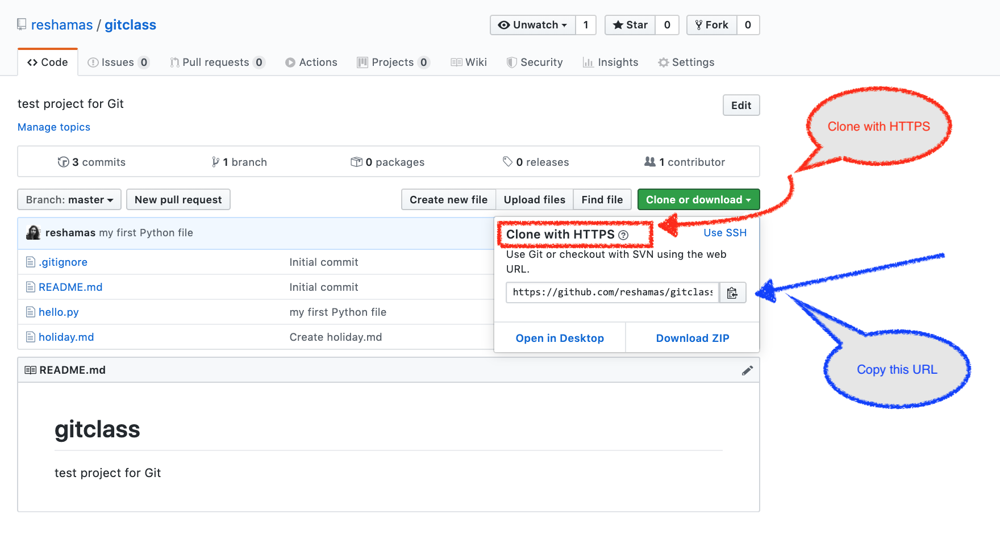

# Workflow x:  Clone, Fork and Submit PR

#### This is your checklist:
- [ ] Create a repo on GitHub (GH)
- [ ] Clone a repo
- [ ] Update a repo 
- [ ] Look at remotes
- [ ] Create a branch
- [ ] Switch to another branch
- [ ] Push changes to GH from terminal
- [ ] Submit a pull request (PR) on GH

---
## Step 1:  Navigate to repo on GitHub
This is the test repository we are practicing with:  [https://github.com/DSC-WAV/proj-test](https://github.com/DSC-WAV/proj-test)

## Step 2:  Fork repo to your account

### Step 2a:  Find the 'fork' option

<kbd>
<p>

</p>
</kbd>


<p>


### Step 2b:  The repo is being forked... 

</p>

<kbd>
<p>

</p>
</kbd>

<p>
	
### Step 2c:  The repo has been forked!

</p>

<kbd>
<p>

</p>
</kbd>


## Step 3: `clone` the repo from GitHub to our terminal

**Q:  What is cloning?**  
**A:  Making a copy of something.**

<p>

</p>


### Copy URL for cloning

Click on the green button for your forked GitHub repo, and ensure it is showing the url for **Clone with HTTPS**  (other option is "Clone with SSH").  Copy that URL.    <br> 
   <br> <br>

<kbd>
<p float="left">
   
  </a>
</p>
</kbd>

<p>
</p>


>example of my repo's ulr  
```text
https://github.com/reshamas/gitclass.git
```

## Step 4:  go to working directory (your local terminal)
Go to your working directory  
>my example
```bash
cd ~/Desktop/gitsample
```

**P**rint **w**orking **d**irectory:  
<kbd> pwd </kbd>

>my example
```bash
pwd
/Users/reshamashaikh/Desktop/gitsample
```  

## Step 5:  clone the repo  
<kbd> git clone <url_name> </kbd> 
>my example
```bash
git clone https://github.com/reshamas/gitclass.git
```
```bash
Cloning into 'gitclass'...
remote: Counting objects: 3, done.
remote: Total 3 (delta 0), reused 0 (delta 0), pack-reused 0
Unpacking objects: 100% (3/3), done.
```

## Step 6:  `cd` into the repo
<kbd> cd <repo_name> </kbd>
>my example
```bash
cd gitclass 
```

## Step 7:  look at remotes
**Q:  What is a remote?**  
**A:  **Remotes** are copies of a repo on another computer **(or on a service like GitHub)****

<kbd> git remote -v </kbd>
>my example
```bash
git remote -v
origin	https://github.com/reshamas/gitclass.git (fetch)
origin	https://github.com/reshamas/gitclass.git (push)
```


**Example:**  
* `origin`   [your forked repo] 
* `upstream` [organization repo]  (will see this later in a fork-repo example)

**Note 1:**  
* notice you have push and pull access  

**Note 2:**
* to remove a remote:  <kbd> git remote rm <remote_name> </kbd>

## Step 8:  update a repo
This step copies changes from a remote repository to a local repository.  
:key:  Do this **before starting work in a repository so you have the most up-to-date-changes.**   
**Note:**  this is a good step to practice even though the first time you clone a repo it will already be up to date.   

- <kbd> git pull </kbd> 
- create `name.py` file on GitHub 
- <kbd> git pull </kbd> to sync repo


---

# :arrow_right_hook: Why use branches?
- **Branching** means you diverge from the main line of development and continue to do work without changing the main line, like "scratch paper" but for online coding.  
- Can work on different parts in the codebase, or "features" or "web page updates"
    - create a separate *history* for each new *feature*
- More details can be found here:  [branches](../git_6_branches.md)


## Step 9:  list branches
<kbd> git branch </kbd>  
>my example
```git
git branch
* master
```

 
## Step 10:  create a working branch
<kbd> git branch <branch_name> </kbd>
	
>my example  
`git branch practice`

## Step 11:  list branches
<kbd> git branch </kbd>  
>my example
```git
git branch
* master
  practice
```

## Step 12:  switch to working branch
<kbd> git checkout <branch_name> </kbd>  
>my example  
`git checkout practice`


## Step 13:  create a file
<kbd>  ls </kbd>  
<kbd> touch <file_name> </kbd>  
	
<kbd> touch mercury.md </kbd>  

>my example
```bash
ls
touch mercury.md
```
```bash
ls
total 8
-rw-r--r--  1   32 Nov 22 09:39 README.md
% touch mercury.md
% ls
total 8
-rw-r--r--  1   32 Nov 22 09:39 README.md
-rw-r--r--  1    0 Nov 22 09:49 mercury.md

	mercury.md
```

---
# :arrow_right_hook: Git Workflow

## Git Flow 
| #     | Command                   | Step  | Description      |
|-------|---------------------------| -----|------------------|
|  1    | `git add <filename>`      | begin tracking a file | adds a change in the working directory to the staging area; tells Git that you want to include updates to a particular file in the next commit.  |    
|  2    | `git commit -m "message"` | log the change | changes are recorded in Git (interaction is with local repo) |  
|  3    | `git push`                | finalize the change | changes are pushed from Git (local, terminal) to GitHub (browser account, remote) | 
 
**Note:**  It is better to make many commits with smaller changes rather than of one commit with massive changes: small commits are easier to read and review.


<p>

</p>

## Step 14:  get status of repo
<kbd> git status </kbd>  
>my example
```bash
% git status
On branch practice
Untracked files:
  (use "git add <file>..." to include in what will be committed)
	mercury.md
nothing added to commit but untracked files present (use "git add" to track)
```
    
## Step 15:  add/stage a file
<kbd> git add <file_name> </kbd>   
	
>my example  
```bash
git add mercury.md 
```

**Note:**  to `add` a file is to begin tracking it:  
- adds a change in the working directory to the staging area
- tells Git that you want to include updates to a particular file in the next commit

## Step 16:  get status of repo
<kbd> git status </kbd>  
>my example
```bash
% git status
On branch practice
Changes to be committed:
  (use "git reset HEAD <file>..." to unstage)

	new file:   mercury.md
```

## Step 17:  commit a file  
<kbd> git commit -m 'message' </kbd>  
	
>my example
```bash
git commit -m 'adding first planet'
```
	
```bash
% git commit -m 'adding first planet'
[practice 3950dd9] adding first planet
 1 file changed, 0 insertions(+), 0 deletions(-)
 create mode 100644 mercury.md
```
**Note:**  to `commit` a file is to "log the change":  
- changes are recorded in Git (interaction is with local repo)

## Step 18:  get status of repo
<kbd> git status </kbd>  
>my example
```bash
% git status
On branch practice
Changes to be committed:
  (use "git reset HEAD <file>..." to unstage)

	new file:   mercury.md
```

## Step 19:  push changes to your 'working branch' 
<kbd> git push <remote_name> <branch_wip> </kbd>  
	
>my example
```bash
git push origin practice
```	

```bash
Counting objects: 3, done.
Delta compression using up to 4 threads.
Compressing objects: 100% (2/2), done.
Writing objects: 100% (3/3), 273 bytes | 0 bytes/s, done.
Total 3 (delta 0), reused 0 (delta 0)
To https://github.com/reshamas/gitclass.git
 * [new branch]      practice -> practice
 ```
**Note:**  to `push` a "commit" is to "finalize the change":  
- changes are pushed from Git (local, terminal) to GitHub (browser account, remote)

## Step 20:  look at files on working branch (on GitHub)
**Note:**  we are on GitHub in browser
- go to repo
- may want to toggle "Branch"
	
## Step 21:  submit pull request (on GitHub)
Go to GitHub and refresh your browser.  
My url is:  https://github.com/reshamas/gitclass  

Select green button "Compare and pull request"  
   <br> <br>

---

## Summary of Steps
<kbd> cd ~/Desktop/gitsample </kbd>  
<kbd>  pwd </kbd>   
<kbd> git clone https://github.com/reshamas/gitclass.git </kbd>   
<kbd> cd gitclass </kbd>   
<kbd> git remote -v </kbd>  
<kbd> git pull </kbd>  
<kbd> git branch </kbd> <kbd> git branch practice </kbd>  
<kbd> git branch </kbd> <kbd> git checkout practice </kbd>  
<kbd>  ls </kbd>  
<kbd> touch mercury.md </kbd>  
<kbd>  ls </kbd>  
<kbd>  git status </kbd> <kbd>  git add mercury.md </kbd>  		  
<kbd>  git status </kbd> <kbd>  git commit -m 'adding first planet' </kbd>  		  
<kbd>  git status </kbd> <kbd>  git push origin practice</kbd>  
